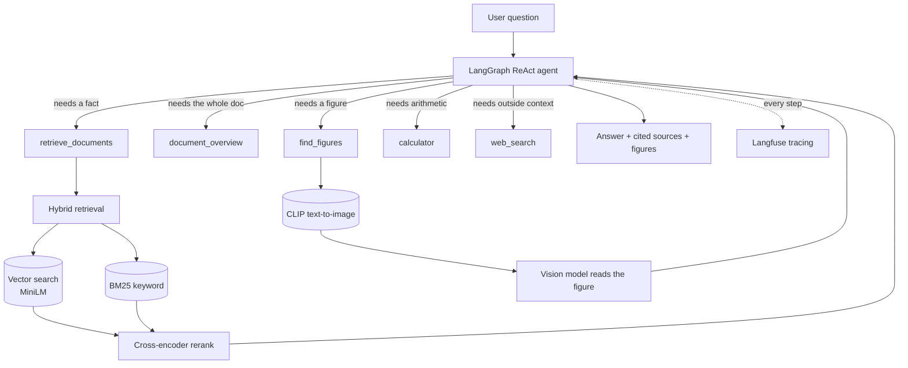

# Agentic Multimodal RAG

Ask questions about your own documents and get answers that show their evidence. Upload
PDFs, Word files, plain text, or images; the agent decides which tools each question
needs, retrieves across prose, tables, and figures, and returns every passage it used.

**[Live demo](https://multimodal-agentic-rag-rbo9fstacukssikdjlq83r.streamlit.app/)** · built entirely on free-tier services

---

## What makes it more than a RAG tutorial

Every claim below is measured against a labelled 15-question evaluation set, not asserted.

| Change | Effect |
|---|---|
| Cross-encoder reranking | Retrieval recall@3 **11/14 → 14/14** |
| Embedding tables with their captions | Tables retrievable for **0/15 → 2/15** questions (they were never retrieved before) |
| Agentic pipeline vs. plain RAG | Faithfulness **0.933 vs 0.819** — after initially scoring *worse* (0.633) until the cause was found |
| CPU-only torch in the image | Container **9.42 GB → 2.72 GB** |

The full record of what was tried, what failed, and why is in
[`docs/evaluation.md`](docs/evaluation.md) and the per-run report at
`data/eval_report.md`.

---

## Architecture



Ingestion runs separately: documents are parsed by type, split into overlapping chunks,
embedded, and stored with namespaced ids so several documents coexist.

---

## Features

- **Agentic** — a ReAct loop chooses tools per question rather than following a fixed
  pipeline. Observed chaining retrieval → calculator unprompted.
- **Hybrid retrieval + reranking** — BM25 fused with vector search by reciprocal rank
  fusion for recall, then a cross-encoder for precision.
- **Multimodal** — tables keep their structure as markdown; figures are found by
  description (CLIP) and read by a vision model.
- **Multi-format, multi-document** — PDF, DOCX, TXT/MD, and images, several at once,
  each with its own id namespace.
- **Cited** — every answer carries the id, type, and preview of each passage used.
- **Grounded** — the agent is instructed to abstain rather than guess. Verified by
  testing: it declines questions its retrieved context cannot answer.
- **Evaluated** — RAGAS faithfulness and relevancy over a labelled set, with a
  regression gate.
- **Traced** — every request produces a Langfuse trace with retrieval scores, tool
  calls, token counts, and latency.
- **Served** — FastAPI with typed schemas, uniform error contracts, and tests.

---

## Quick start

```bash
python -m venv venv && source venv/Scripts/activate   # Windows: .\venv\Scripts\activate
pip install -r requirements.txt
cp .env.example .env        # add your free GROQ_API_KEY
streamlit run src/app.py
```

Upload a document from the sidebar and ask away. Nothing is indexed until you do.

<details>
<summary>Other ways to run it</summary>

**Whole stack in Docker** — builds the index, then serves the API on :8000:

```bash
docker compose up
```

**API only:**

```bash
uvicorn api:app --app-dir src --reload
```

**UI against the API** rather than in-process:

```bash
RAG_API_URL=http://localhost:8000 streamlit run src/app.py
```

**Index from the command line:**

```bash
python src/ingest.py path/to/document.pdf
```

</details>

---

## Evaluation

```bash
python src/run_eval.py            # score both pipelines, write data/eval_report.md
python src/run_eval.py --reuse    # rebuild the report from stored scores, no API calls
```

Scores both the agentic and baseline pipelines with RAGAS under identical conditions —
same generator model, a *different* judge model at temperature 0, answers cached so runs
are reproducible. Exits non-zero if faithfulness falls below a floor, so it works as a
gate.

It is deliberately **not** wired into CI: the source documents are private and the judge
costs real API quota, so an automated run would either score against an empty index or
exhaust the free tier. Reasoning in [`docs/evaluation.md`](docs/evaluation.md).

## Tests

```bash
python -m pytest tests/ -q       # 15 tests, no network, no API quota
```

The agent is stubbed, so the suite exercises the HTTP contract, session handling,
validation, and every upstream failure mapping for free — which is what makes it viable
as a CI gate on every push.

---

## Known limitations

Documented rather than hidden — see [`docs/documents.md`](docs/documents.md) for detail.

- **Figure reading is descriptive, not precise.** The vision model correctly identifies
  what a chart *is* and describes it, but extracting exact values from a dense heatmap is
  unreliable — verified failing across repeated attempts. Use the underlying table.
- **Scanned PDFs are rejected**, with an explicit message. There is no OCR step.
- **Table detection needs ruled lines.** A borderless, whitespace-aligned table is missed
  and survives only as prose.
- **Small-model reasoning errors persist.** The 8B model occasionally reads the wrong
  column of a correctly-retrieved table. Retrieval is no longer the bottleneck;
  generation is.
- **Free-tier rate limits are low** (6,000 tokens/minute), so large contexts can fail
  outright rather than degrade.

---

## Stack

| Layer | Choice |
|---|---|
| LLM | Groq — `llama-3.1-8b-instant` for text, `qwen/qwen3.6-27b` for vision |
| Agent | LangGraph (ReAct loop, checkpointed conversation memory) |
| Embeddings | `all-MiniLM-L6-v2`, CLIP for images, `ms-marco-MiniLM-L-6-v2` for reranking |
| Vector store | ChromaDB |
| Keyword search | `rank_bm25` |
| Parsing | PyMuPDF, pdfplumber, python-docx |
| Evaluation | RAGAS |
| Observability | Langfuse |
| Serving | FastAPI, Streamlit |
| Delivery | Docker, GitHub Actions |

Every component is free or open-source; the whole project was built and evaluated within
free-tier limits.

---

## Documentation

- [`docs/api.md`](docs/api.md) — endpoints, schemas, error contracts
- [`docs/evaluation.md`](docs/evaluation.md) — how the system is scored, and why not in CI
- [`docs/documents.md`](docs/documents.md) — supported formats and what is not handled
- [`docs/deployment.md`](docs/deployment.md) — deploying the demo
